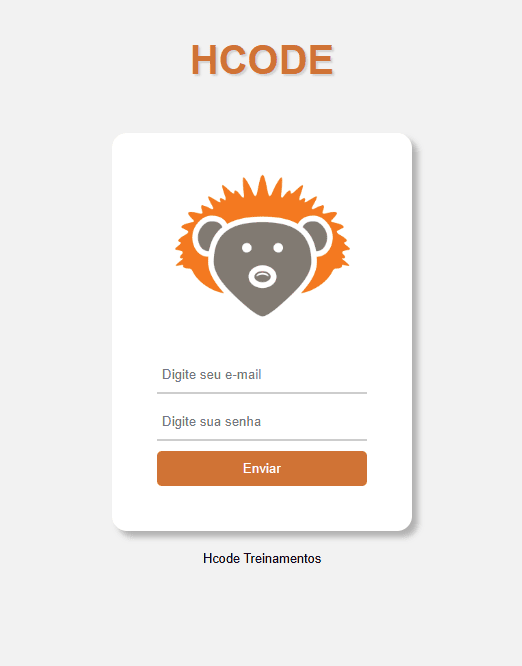
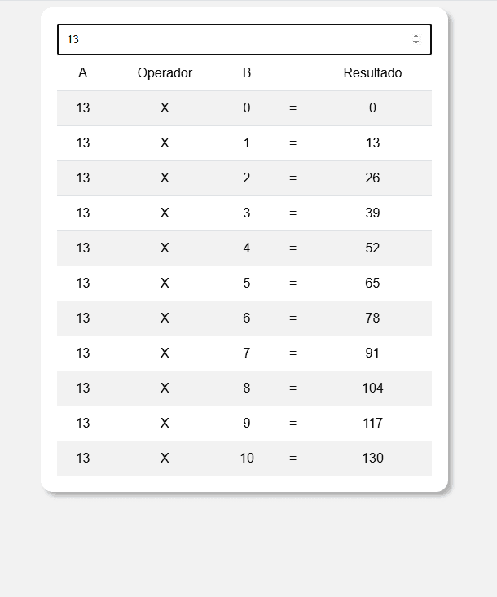
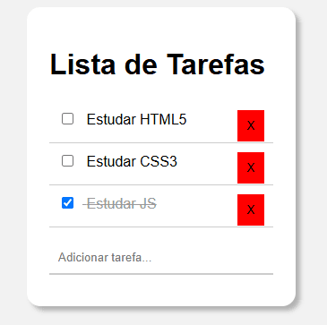
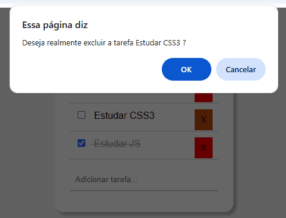

# html5-hcode
Curso de HTML5 completo da hcode

## Assunto
Curso de HTML5 da hcode, estou estudando para aperfeiçoar meus conhecimentos com essa linguagem de marcação. Meu objetivo e rever tags, atributos e utilização de eventos na estrutura da parte de front-end com HTML5.

## Seção
Atributos globais - [https://github.com/wesleyanjoszero/html5-hcode/tree/main/atributos-globais]

Tags - [https://github.com/wesleyanjoszero/html5-hcode/tree/main/tags]

Eventos - [https://github.com/wesleyanjoszero/html5-hcode/tree/main/eventos]

Tela Login - [https://github.com/wesleyanjoszero/html5-hcode/tree/main/Tela-Login]

Tabuada - [https://github.com/wesleyanjoszero/html5-hcode/tree/main/Tabuada]

Lista de Tarefas - [https://github.com/wesleyanjoszero/html5-hcode/tree/main/Lista-Tarefas]

Site Responsivo - [https://github.com/wesleyanjoszero/html5-hcode/tree/main/Site]

## Projeto Tela Login

Uma tela de login utilizando estrutura HTML5 !

## Projeto Tabuada

Uma painel com input feito em __HTML5__, utilizando __JavaScript__ para criar as linhas dinâmicamente com os valores !

## Projeto Lista Tarefas

Uma simples lista de tarefas feita com __HTML5__, __CSS3__ e __JavaScript__. Podemos adicionar tarefas, marcar como concluídas e excluir.

## Site Responsivo

Uma simples landing page de uma página inicial de exemplo feita com HTML5, CSS3 e JavaScript. Totalmente responsivo com menu mobile. 
